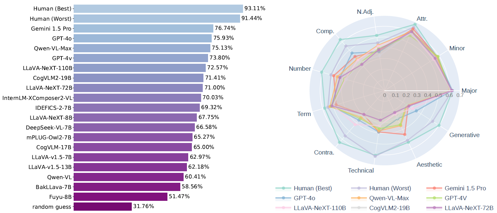
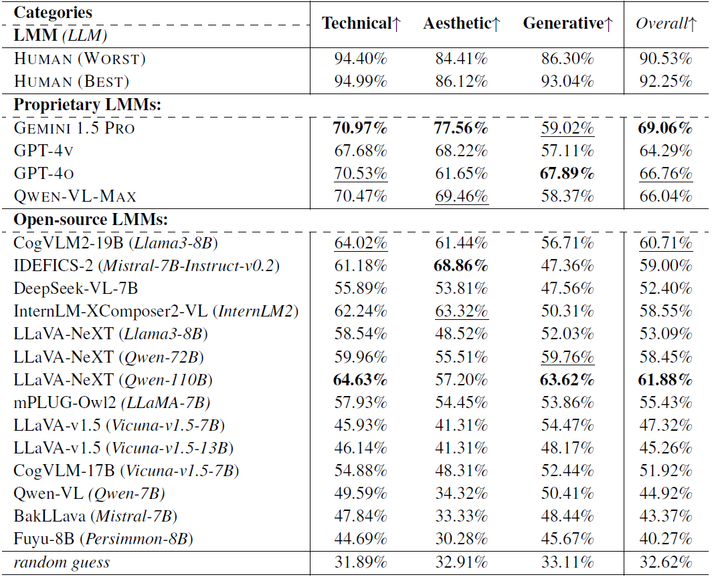

<div align="center">
    
    
 <div>

<a href="https://github.com/Q-Future/"></a>
    <a href="https://github.com/Q-Future/A-Bench"></a>
    <a href="https://arxiv.org/abs/2309.14181"></a>
    <a href="https://github.com/Q-Future/A-Bench/releases/tag/v1.0.1.1014datarelease"></a>
   </div>


  <h1>A-Bench: Are LMMs Masters at Evaluating AI-generated Images?</h1>

  <div>
      <a href="https://zzc-1998.github.io/" target="_blank">Zicheng Zhang</a><sup>1</sup><sup>*</sup>,
      <a href="https://teowu.github.io/" target="_blank">Haoning Wu</a><sup>2</sup><sup>*</sup>,
      <a href="https://github.com/lcysyzxdxc" target="_blank">Chunyi Li</a><sup>1</sup><sup>*</sup>,
      <a href="=" target="_blank">Yingjie Zhou</a><sup>1</sup>,
      <a href="" target="_blank">Wei Sun</a><sup>1</sup>,
  </div>

<div>
      <a href="" target="_blank">Xiongkuo Min</a><sup>1</sup>
      <a href="" target="_blank">Zijian Chen</a><sup>1</sup>
      <a href="" target="_blank">Xiaohong Liu</a><sup>1</sup>
      <a href="https://personal.ntu.edu.sg/wslin/Home.html" target="_blank">Weisi Lin</a><sup>2</sup>,
      <a href="https://ee.sjtu.edu.cn/en/FacultyDetail.aspx?id=24&infoid=153&flag=153" target="_blank">Guangtao Zhai</a><sup>1</sup><sup>#</sup>
      
  </div>
  <div>
  <sup>1</sup>Shanghai Jiaotong University,  <sup>2</sup>Nanyang Technological University
       </div>   
<div>
<sup>*</sup>Equal contribution. <sup>#</sup>Corresponding author. 
   </div>
    
  <div style="width: 100%; text-align: center; margin:auto;">
      
  </div>
  

T2I models aim to create images that accurately align with the text and showcase high perceptual quality. Therefore, the proposed A-Bench includes two parts to diagnose whether LMMs are masters at evaluating AIGIs: **1) Semantic Understanding, 2) Quality Perception**.
 
<div align="left">
    
## A-Bench Construction
    
Two key diagnostic subsets are defined: **A-Bench-P1** → high-level semantic understanding, and **A-Bench-P2** → low-level quality perception. For high-level semantic understanding, **A-Bench-P1** targets three critical areas: *Basic Recognition, Bag-of-Words Pitfalls Discrimination*, and *Outside Knowledge Realization*, which are designed to progressively test the LMM’s capability in AIGI semantic understanding, moving from simple to complex prompt-related content. For low-level quality perception, **A-Bench-P2** concentrates on *Technical Quality Perception, Aesthetic Quality Evaluation*, and *Generative Distortion Assessment*, which are designed to cover the common quality issues and AIGI-specific quality problems. 

Specifically, a comprehensive dataset of 2,864 AIGIs sourced from various T2I models is compiled, including 1,408 AIGIs for **A-Bench-P1** and 1,456 for **A-Bench-P2**. Each AIGI is paired with a question-answer set annotated by human experts.

  <div style="width: 100%; text-align: center; margin:auto;">
      
  </div>

  
## A-Bench Performance
For *open-source* models, LLaVA-NeXT (Qwen-110B) takes the first place. For *closed-source* models, GEMINI 1.5 PRO takes the first place.

<div align="center">
<div style="width: 100%; text-align: center; margin:auto;">
  
</div>
    
**A Quick Look of the A-Bench Outcomes.**

<div style="width: 80%; text-align: center; margin:auto;">
  
</div>

**Performance on A-Bench-P1.**

<div style="width: 100%; text-align: center; margin:auto;">
  
</div>

**Performance on A-Bench-P2.**

</div>


## Evaluate your model on A-Bench

Instructions are coming soon!

## Contact

Please contact any of the first authors of this paper for queries.

- Zicheng Zhang, `zzc1998@sjtu.edu.cn`, @zzc-1998
- Haoning Wu, `haoning001@e.ntu.edu.sg`, @teowu


## Citation

If you find our work interesting, please feel free to cite our paper:

```bibtex
@inproceedings{wu2024qbench,
    author = {Wu, Haoning and Zhang, Zicheng and Zhang, Erli and Chen, Chaofeng and Liao, Liang and Wang, Annan and Li, Chunyi and Sun, Wenxiu and Yan, Qiong and Zhai, Guangtao and Lin, Weisi},
    title = {A-Bench: A Benchmark for General-Purpose Foundation Models on Low-level Vision},
    booktitle = {ICLR},
    year = {2024}
}
```
