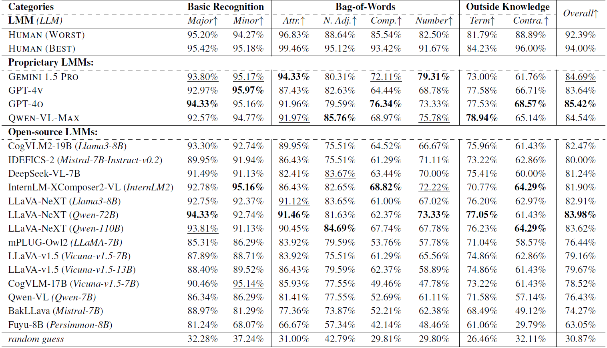

<div align="center">
    
    
 <div>

<a href="https://github.com/Q-Future/"></a>
    <a href="https://github.com/Q-Future/A-Bench"></a>
    <a href="https://arxiv.org/pdf/2406.03070"></a>
    <a href="https://huggingface.co/datasets/q-future/A-Bench"></a>
   </div>

  <div style="width: 100%; text-align: center; margin:auto;">
      
  </div>
  
  <h1>A-Bench: Are LMMs Masters at Evaluating AI-generated Images?</h1>
  
_What do we expect from LMMs as AIGI evaluators and how do they perform?_

  <div>
      <a href="https://zzc-1998.github.io/" target="_blank">Zicheng Zhang</a><sup>1</sup><sup>*</sup>,
      <a href="https://teowu.github.io/" target="_blank">Haoning Wu</a><sup>2</sup><sup>*</sup>,
      <a href="https://github.com/lcysyzxdxc" target="_blank">Chunyi Li</a><sup>1</sup><sup>*</sup>,
      <a href="https://scholar.google.com/citations?hl=zh-CN&user=85yWgIcAAAAJ" target="_blank">Yingjie Zhou</a><sup>1</sup>,
      <a href="https://scholar.google.com/citations?hl=zh-CN&user=nDlEBJ8AAAAJ" target="_blank">Wei Sun</a><sup>1</sup>,
  </div>

<div>
      <a href="https://minxiongkuo.github.io/" target="_blank">Xiongkuo Min</a><sup>1</sup>,
      <a href="https://scholar.google.com/citations?hl=zh-CN&user=NSR4UkMAAAAJ" target="_blank">Zijian Chen</a><sup>1</sup>,
      <a href="https://scholar.google.ca/citations?user=Tq2hoMQAAAAJ&hl=en" target="_blank">Xiaohong Liu</a><sup>1</sup>,
      <a href="https://personal.ntu.edu.sg/wslin/Home.html" target="_blank">Weisi Lin</a><sup>2</sup>,
      <a href="https://ee.sjtu.edu.cn/en/FacultyDetail.aspx?id=24&infoid=153&flag=153" target="_blank">Guangtao Zhai</a><sup>1</sup><sup>#</sup>
      
  </div>
  <div>
  <sup>1</sup>Shanghai Jiaotong University,  <sup>2</sup>Nanyang Technological University
       </div>   
<div>
<sup>*</sup>Equal contribution. <sup>#</sup>Corresponding author. 
   </div>
  <a href="https://github.com/Q-Future/A-Bench/blob/main/A_Bench__Are_LMMs_Masters_at_Evaluating_AI_generated_Images_.pdf"><strong>Paper</strong></a> |
<a href="https://a-bench-sjtu.github.io/"><strong>Project Page</strong></a> |
<a href="https://github.com/Q-Future/A-Bench"><strong>Github</strong></a> |
 <a href="https://huggingface.co/datasets/q-future/A-Bench"><strong>Data</strong></a> 
  <div style="width: 100%; text-align: center; margin:auto;">
      
  </div>
  
<div align="left">
    
T2I models aim to create images that accurately align with the text and showcase high perceptual quality. Therefore, the proposed A-Bench includes two parts to diagnose whether LMMs are masters at evaluating AIGIs: **1) Semantic Understanding, 2) Quality Perception**.
 


## Release
- [2024/6/5] 🔥 We are releasing the **A-Bench** data and meta information at [Huggingface](https://huggingface.co/datasets/q-future/A-Bench).
- [2024/6/3] 🔥 [Github repo](https://github.com/Q-Future/A-Bench) for **A-Bench** is online. Do you want to find out if your LMM is a master at evaluating AI-generated images? Come and test on **A-Bench** !!

  
## A-Bench Construction
    
Two key diagnostic subsets are defined: **A-Bench-P1** → high-level semantic understanding, and **A-Bench-P2** → low-level quality perception. For high-level semantic understanding, **A-Bench-P1** targets three critical areas: *Basic Recognition, Bag-of-Words Pitfalls Discrimination*, and *Outside Knowledge Realization*, which are designed to progressively test the LMM’s capability in AIGI semantic understanding, moving from simple to complex prompt-related content. For low-level quality perception, **A-Bench-P2** concentrates on *Technical Quality Perception, Aesthetic Quality Evaluation*, and *Generative Distortion Assessment*, which are designed to cover the common quality issues and AIGI-specific quality problems. 

Specifically, a comprehensive dataset of 2,864 AIGIs sourced from various T2I models is compiled, including 1,408 AIGIs for **A-Bench-P1** and 1,456 for **A-Bench-P2**. Each AIGI is paired with a question-answer set annotated by human experts.
We are open to **submission-based evaluation** for **A-Bench**. The details for submission are in the **Evaluate your model on A-Bench** Section.

  <div style="width: 100%; text-align: center; margin:auto;">
      
  </div>

  
## Glance at A-Bench Performance
For *open-source* models, **LLaVA-NeXT (Qwen-110B)** takes the first place. For *closed-source* models, **GEMINI 1.5 PRO** takes the first place.

<div align="center">
<div style="width: 100%; text-align: center; margin:auto;">
  
</div>
    
**A Quick Look of the A-Bench Outcomes.**


|**Participant Name** | Major↑ | Minor↑ | Attr.↑ | N. Adj.↑ | Comp.↑ | Number↑ | Term↑ | Contra.↑ | Technical↑ | Aesthetic↑ | Generative↑ |
| - | - | - | - | - | - | -| - | - | - | - | - |
| Gemini 1.5 Pro | 93.80% | 95.17% | 94.33% | 80.31% | 72.11% | 79.31% | 73.00% | 61.76% | 70.97% | 77.56% | 59.02% |
| GPT-4v | 92.97% | 95.97% | 87.43% | 82.63% | 64.44% | 68.78% | 77.58% | 66.71% | 67.68% | 68.22% | 57.11% |
| GPT-4o | 94.33% | 95.16% | 91.96% | 79.59% | 76.34% | 73.33% | 77.53% | 68.57% | 70.53% | 61.65% | 67.89% |
| Qwen-VL-Max | 92.57% | 94.77% | 91.97% | 85.76% | 68.97% | 75.78% | 78.94% | 65.14% | 70.47% | 69.46% | 58.37% |
| Human (Worst) | 95.20% | 94.27% | 96.83% | 88.64% | 85.54% | 82.50% | 81.79% | 88.89% | 94.40% | 84.41% | 86.30% |
| Human (Best) | **95.42%** | **95.18%** | **99.46%** | **95.12%** | **93.42%** | **91.67%** | **84.23%** | **96.00%** | **94.99%** | **86.12%** | **93.04%** |
<div align="left">  
    
We release the performance of top-tier *closed-source* LMMs against humans.
Two conclusions can be obtained: 
    
1) **LMMs excel at basic recognition tasks but tend to be less effective
when it comes to nuanced semantic understanding.**

2) **LMMs are poor quality evaluators.**


## Detailed A-Bench Performance

</div>

<div style="width: 80%; text-align: center; margin:auto;">
  
</div>

**Performance on A-Bench-P1.**

<div style="width: 100%; text-align: center; margin:auto;">
  
</div>

**Performance on A-Bench-P2.**

</div>


## Evaluate your model on A-Bench

First download the dataset and meta information from [Huggingface](https://huggingface.co/datasets/q-future/A-Bench).

The *imgs.zip* contains all the AI-generated images and *Abench.json* contains all the meta information including the img_path, questions, answers, and categories. The item of *Abench.json* is structured like:

```
"img_path": "part1_0000.png",
"question": "What is the color of the windows in the house in the picture?",
"answers": [
    "white",
    "yellow",
    "blue"
],
"category": "part1 -> basic_recognition -> major"
```
The "img_path" indicates the path to the image in *imgs.zip*, the "question" is a string, the "answers" is a list of answer candidates (several false answers and the correct answer).

The correct answers are kept confidential to ensure A-Bench retains its long-term value as a benchmark for assessing AIGI evaluation capabilities.

To test with your LMM, we suggest using the following prompt:

```
import json
with open("Abench.json", "r") as f:
    f = f.read()
    data = json.loads(f)

for item in data:
    image_file = 'path-to-imgs' + item["img_path"]
    message = item["question"] + "\n"
    for choice, ans in zip(["A.", "B.", "C.", "D."], item["answers"]):
        message += f"{choice} {ans}\n"
    message = message + "Answer with the option's letter from the given choices directly."
    print(message)

    # What is the color of the windows in the house in the picture?
    # A.white
    # B.yellow
    # C.blue
    # Answer with the option's letter from the given choices directly.

    # do your test here
    # response = LMM(image_file,message)
    item['response'] = response
    with open("results.jsonl", "a") as wf:
            json.dump(item, wf)
            wf.write("\n")
```

After finishing validation, you can submit the results via [e-mail](zzc1998@sjtu.edu.cn) to get your LMM results on A-Bench !

## Contact

Please contact any of the first authors of this paper for queries.

- Zicheng Zhang, `zzc1998@sjtu.edu.cn`, @zzc-1998
- Haoning Wu, `haoning001@e.ntu.edu.sg`, @teowu

## Citation

If you find our work interesting, please feel free to cite our paper:

```bibtex
@misc{zhang2024abench,
      title={A-Bench: Are LMMs Masters at Evaluating AI-generated Images?}, 
      author={Zicheng Zhang and Haoning Wu and Chunyi Li and Yingjie Zhou and Wei Sun and Xiongkuo Min and Zijian Chen and Xiaohong Liu and Weisi Lin and Guangtao Zhai},
      year={2024},
      eprint={2406.03070},
      archivePrefix={arXiv},
      primaryClass={cs.CV}
}
```
